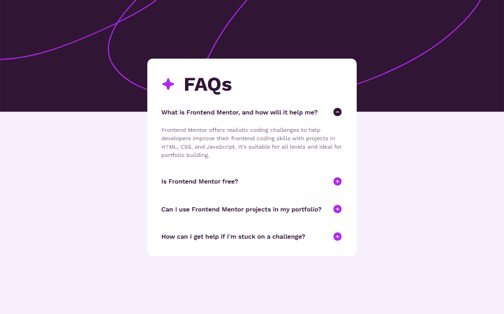

# Frontend Mentor - FAQ accordion solution

This is a solution to the [FAQ accordion challenge on Frontend Mentor](https://www.frontendmentor.io/challenges/faq-accordion-wyfFdeBwBz). Frontend Mentor challenges help you improve your coding skills by building realistic projects.

## Table of contents

- [Overview](#overview)
  - [The challenge](#the-challenge)
  - [Screenshot](#screenshot)
  - [Links](#links)
- [My process](#my-process)
  - [Built with](#built-with)
  - [What I learned](#what-i-learned)
  - [Continued development](#continued-development)
  - [Useful resources](#useful-resources)
- [Author](#author)

## Overview

### The challenge

Users should be able to:

- Hide/Show the answer to a question when the question is clicked
- Navigate the questions and hide/show answers using keyboard navigation alone
- View the optimal layout for the interface depending on their device's screen size
- See hover and focus states for all interactive elements on the page

### Screenshot

### Links

- Solution URL: [Github page](https://github.com/artemkotko14/faq-accordion)
- Live Site URL: [Webpage](https://artemkotko14.github.io/faq-accordion/)

## My process

### Built with

- Semantic HTML5 markup
- Flexbox
- SASS
- Mobile-first workflow
- Keyboard navigation support

### What I learned

I learned how to build accessible accordions using the semantic 
 and 
 elements, and how to style their open state with selectors like .accordion[open] without using JavaScript.

### Continued development

For continued development, I want to improve my understanding of accessible interactive components such as accordions and disclosures. I also plan to continue practicing responsive layouts, cleaner SCSS architecture, and more advanced state styling using CSS selectors like [open] and pseudo-elements instead of relying on JavaScript for simple UI interactions.

### Useful resources

- [Code Less with the HTML Details Tag ](https://www.youtube.com/watch?v=rcbDw2OPX-U) - This Youtube video helped me understand HTML5 Details tag.
- [How to build an accessible accordion](https://www.youtube.com/watch?v=rizW6xxWxRE) - This Youtube video helped me understand how to make my accordion more accessible.

## Author

- Github - [Artem Kotko](https://github.com/artemkotko14)
- Frontend Mentor - [@artemkotko14](https://www.frontendmentor.io/profile/artemkotko14)
